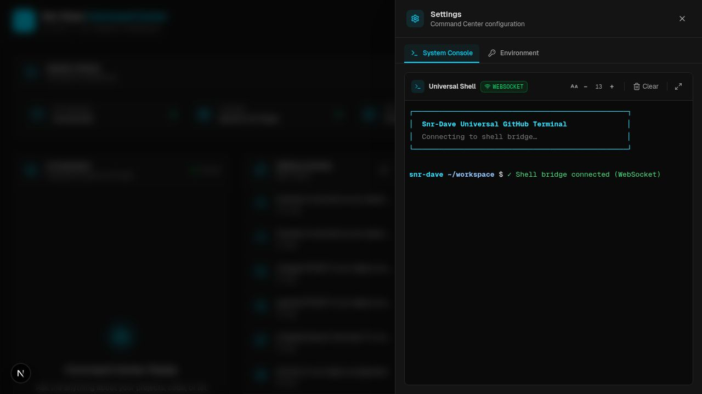

<div align="center">

# ⚡ Snr-Dave AI Assistant

### Personal Command Center — AI Chat · GitHub Intelligence · System Monitoring

<p>
  <a href="https://nextjs.org"></a>
  <a href="https://typescriptlang.org"></a>
  <a href="https://tailwindcss.com"></a>
  <a href="https://ai.google.dev"></a>
  <a href="https://replit.com"></a>
</p>

---

</div>

## 🖥️ Dashboard Preview


> **Deep Charcoal** background · **Electric Cyan** accents · Live data across every panel

### Universal Shell — Settings Panel



> Glassmorphism slide-over with the **Universal Shell** on its low-latency WebSocket transport — `gh` CLI pre-authenticated, persistent CWD, broadcast bus mirroring AI- and HTTP-issued commands

---

## ✨ Features

### 🤖 AI Chat Assistant
- Streaming conversations powered by **Google Gemini 2.5 Flash**
- Real-time typing indicator and send-button spinner during generation
- Full message history with auto-scroll
- Model status badge shown in the chat header
- **GitHub Agent Tools** — the AI can read files, create branches, and commit code directly to your repos

### 🐙 GitHub Activity Feed
- Live feed of the latest events from `@Snr-Dave` via a server-side proxy
- Push events, PR merges, branch creation, issues, stars, and more
- Event-specific icons and relative timestamps
- Auto-refreshes every **60 seconds** via SWR

### 📁 Projects Grid
- Pulls repositories live from the GitHub API (server-side with auth)
- Shows language badge, star count, and fork count per repo
- Filters out forks — only original work shown
- External link to each repository

### 📡 System Status Bar
- Health checks for **API Gateway**, **AI Model**, and **GitHub API**
- Displays last-check timestamp
- Auto-checks every 60 seconds, manual refresh button available
- All-green · partial-warning · offline states with distinct colour coding

### ⚙️ Settings Panel
A right-edge slide-over (also accessible from the header gear icon) hosting two tabs:

**System Console** — full-featured terminal embedded in the dashboard
- Live `bash` shell bridged via Socket.IO over `pages/api/terminal/shell.ts`
- xterm.js with copy-on-select, font-size A−/A+ controls (10–20 px)
- Full-height toggle expands the panel to cover the whole viewport for an immersive console
- `Ctrl+L` / **Clear** redraws the prompt; **Copy** lifts the current selection to the clipboard

**Environment** — Dynamic Secret Creator
- Lists every variable in `.env` with masked values (`••••••`) and a per-row eye toggle
- Inline editing with `⌘/Ctrl + Enter` save shortcut and a green **Saved** confirmation pill
- **+ Add Secret** spawns a new draft row with a validated key field — keys must match `^[A-Z_][A-Z0-9_]*$`
- Backed by `pages/api/settings/env.ts` which reads/writes `.env` while preserving comments, blank lines, indentation, and quoting

---

## 🛠️ Tech Stack

| Layer | Technology |
|-------|-----------|
| **Framework** | Next.js 16.2.4 — App Router + Turbopack |
| **Language** | TypeScript 5.x |
| **AI Runtime** | Vercel AI SDK v6 (`ai@6`) + `@ai-sdk/google` |
| **AI Model** | Google Gemini 2.5 Flash |
| **GitHub Client** | Octokit REST (`@octokit/rest`) |
| **Styling** | Tailwind CSS v4 — utility-first |
| **Data Fetching** | SWR — stale-while-revalidate |
| **Icons** | Lucide React |
| **Fonts** | Geist Sans · Geist Mono |
| **Platform** | Replit (dev & prod) |

---

## 🤖 GitHub Agent Tools

The AI assistant has direct access to your GitHub repositories via nine built-in tools. These run **server-side** using `GITHUB_TOKEN` — the model decides when to call them based on your messages.

| Category | Tool | What it does |
|----------|------|-------------|
| File & Branch | `readFile` | Read any file from any `Snr-Dave` repo at any ref |
| File & Branch | `createBranch` | Create a new branch from a specified base |
| File & Branch | `commitFile` | Create or update a file and commit it to a branch |
| Settings | `getRepoSettings` | Visibility, topics, default branch |
| Settings | `setRepoSecret` | Create / overwrite a GitHub Actions secret (write-only) |
| Settings | `manageActions` | Create / update workflow YAML in `.github/workflows/` |
| PR & Merge | `createPullRequest` | Open a PR between two branches |
| PR & Merge | `mergePullRequest` | Merge a PR by number (merge / squash / rebase) |
| PR & Merge | `mergeBranches` | Direct branch sync without a PR |

> Built with **Vercel AI SDK v6** `tool()` + `jsonSchema<T>()` — up to 10 chained tool steps per conversation turn.

---

## 🖥️ System Console & AI Shell Bridge

The **System Console** tab in Settings runs a live `bash -i` process inside the workspace, streamed to xterm.js via Socket.IO at `path: /api/terminal/socket.io`. The shell is spawned per-connection in `/home/runner/workspace` with `TERM=xterm-256color`, and is killed with `SIGHUP` on disconnect.

**AI Shell Bridge — Phase 1** (`lib/shell-tool.ts`)

The chat assistant is prompted with a `SHELL_PROMPT_FRAGMENT` instructing it to emit shell commands inside fenced blocks tagged **`bash-exec`**:

````markdown
```bash-exec
git status --short
```
````

The library exposes:
- `formatBashExec(command)` — wrap a command in a `bash-exec` fence
- `parseBashExec(text)` — extract every `bash-exec` block from a markdown payload
- `hasBashExec(text)` — fast boolean check
- `BASH_EXEC_LANG` constant + the canonical prompt fragment

Phase 2 will wire a one-click **Run in Console** action in the chat UI that pushes the command into the active terminal socket.

---

## 📂 Project Structure

```
snr-dave-ai-assistant/
├── app/
│   ├── api/
│   │   ├── chat/
│   │   │   └── route.ts          # AI chat — Gemini 2.5 Flash + GitHub tools
│   │   └── github/
│   │       ├── events/
│   │       │   └── route.ts      # Server-side GitHub events proxy
│   │       └── repos/
│   │           └── route.ts      # Server-side GitHub repos proxy
│   ├── globals.css               # Tailwind config & design tokens
│   ├── layout.tsx                # Root layout with Geist fonts
│   └── page.tsx                  # Main dashboard page
├── components/
│   ├── chat-window.tsx           # Streaming AI chat interface
│   ├── dashboard-header.tsx      # Top navigation bar (opens Settings panel)
│   ├── github-feed.tsx           # Live GitHub activity feed
│   ├── projects-grid.tsx         # Repository cards grid
│   ├── system-status.tsx         # Health monitoring bar
│   ├── settings-panel.tsx        # Slide-over with System Console + Environment tabs
│   ├── dashboard-terminal.tsx    # Terminal header (font size, copy, clear, full-height)
│   ├── xterm-core.tsx            # xterm.js + Socket.IO client (dynamic, SSR-disabled)
│   └── environment-manager.tsx   # .env editor with masking, eye-toggle, Add Secret
├── pages/
│   └── api/
│       ├── terminal/
│       │   └── shell.ts          # Socket.IO bash bridge (path /api/terminal/socket.io)
│       └── settings/
│           └── env.ts            # GET / PUT for .env with format preservation
├── lib/
│   ├── projects.ts               # Project type definitions
│   └── shell-tool.ts             # AI Shell Bridge — bash-exec format / parse helpers
├── attached_assets/
│   └── screenshots/
│       └── dashboard-preview.jpg # Dashboard preview image
├── next.config.ts                # allowedDevOrigins for Replit HMR
└── replit.md                     # Replit environment reference
```

---

## 🔐 Environment Variables

Configure these as **Replit Secrets** (or `.env.local` for local dev). The
table below reflects the **live audit on the `terminal-f` branch** —
status was cross-checked against the Replit secret store.

| Variable | Required | Purpose | Status (terminal-f) |
|----------|----------|---------|---------------------|
| `GOOGLE_API_KEY` | ✅ Yes | Google AI Studio key — powers Gemini 2.5 Flash chat (`app/api/chat/route.ts`) | ❌ **Missing** — chat will 500 until set |
| `GITHUB_TOKEN` | ✅ Yes | GitHub PAT — Octokit + AI agent tools + injected into every shell spawn | ✅ Found in Secrets (active as `Snr-Dave` per `gh auth status`) |
| `GH_TOKEN` | ⚪ Auto | Mirrored from `GITHUB_TOKEN` by `lib/exec-shell.ts` for the `gh` CLI — do not set manually | ⚪ Not required — covered by `GITHUB_TOKEN` |
| `REPLIT_DEV_DOMAIN` | ⚪ Auto | Replit runtime; appended to Next.js `allowedDevOrigins` so the proxied preview iframe loads | ✅ Found (runtime-managed) |
| `HOME` | ⚪ Auto | Resolved by the xterm client for cwd display fallback | ✅ Found (system) |

> All secrets are used **server-side only** — never exposed to the browser.

### Adding secrets at runtime

Three ways to set / rotate a value, in increasing order of friction:

1. **Settings → Environment tab** (recommended for app-managed `.env`)
   - Click the gear icon in the dashboard header → **Environment**.
   - Click **+ Add Secret**, enter a key matching `^[A-Z_][A-Z0-9_]*$` (the input auto-uppercases and validates live), enter the value, hit **Save** (or `⌘/Ctrl + Enter`).
   - The variable is appended to `.env` in the workspace root with `0600` permissions, with whitespace/quotes auto-escaped. Existing rows can be edited inline; the eye icon toggles the masked display.
   - **Restart the dev workflow** (or hit "Restart" in the Replit UI) so libraries that snapshot env at boot pick up the change.

2. **Replit Secrets panel** — for values you never want stored in the repo. Replit injects these into `process.env` at boot; they take precedence over `.env`.

3. **Edit `.env` directly** — the file format is preserved by the API, so manual edits and UI edits coexist safely (comments and blank lines are kept intact).

---

## 🚀 Getting Started

### Prerequisites
- Node.js 18.x or later
- A [Google AI Studio](https://aistudio.google.com) API key
- A GitHub Personal Access Token with `repo` scope

### Run locally

```bash
# 1. Clone
git clone https://github.com/Snr-Dave/snr-dave-ai-assistant.git
cd snr-dave-ai-assistant

# 2. Install
npm install

# 3. Set secrets
cp .env.example .env.local
# → add GOOGLE_API_KEY and GITHUB_TOKEN

# 4. Start
npm run dev
# → http://localhost:5000
```

### Run on Replit

This repo is wired for Replit out-of-the-box. The `.replit` manifest
declares Node 20, the `web` + `nix` modules, and a `Start application`
workflow that runs `npm run dev` and waits for port 5000 (mapped to
external port 80). `replit.nix` adds the `gh` CLI so the AI's shell
tools have GitHub access on first boot.

```bash
# 1. After cloning into a Repl
npm install

# 2. Add secrets via the Secrets pane (or Settings → Environment in-app)
#    GOOGLE_API_KEY  — required for Gemini chat
#    GITHUB_TOKEN    — required for Octokit + agent tools + gh CLI

# 3. Run the "Start application" workflow
#    The dashboard appears at $REPLIT_DEV_DOMAIN on port 5000
```

`gh auth status` should report **Logged in as `Snr-Dave`** once
`GITHUB_TOKEN` is in the secret store — the CLI auto-picks it up.

---

## 🌐 API Reference

### `POST /api/chat`
Stream a conversation with the AI assistant.

```json
// Request body
{
  "messages": [
    { "role": "user", "content": "What files are in my main repo?" }
  ]
}
```
**Response:** Server-Sent Events stream (AI SDK data stream protocol).

---

### `GET /api/chat`
Health check — confirms the model is reachable.

```json
{ "status": "ok", "model": "gemini-2.5-flash" }
```

---

### `GET /api/github/events`
Returns the latest 10 GitHub events for `@Snr-Dave`.
Authenticated server-side with `GITHUB_TOKEN` to avoid rate limits.

---

### `GET /api/github/repos`
Returns original (non-forked) repositories for `@Snr-Dave`.
Authenticated server-side with `GITHUB_TOKEN`.

---

### `GET /api/settings/env`
Returns every entry parsed from `.env`, merged with the seeded key list so the UI is useful even before the file exists.

```json
{ "entries": [{ "key": "GOOGLE_API_KEY", "value": "" }, …] }
```

### `PUT /api/settings/env`
Upsert a single variable. Body: `{ "key": string, "value": string }`. Validates `key` against `^[A-Z_][A-Z0-9_]*$`, caps `value` at 8 KB, auto-quotes values containing whitespace / `#` / `=` / quotes (with proper escaping), and preserves all unrelated lines (comments, blanks, indentation, quoting style of other keys).

### `GET /api/terminal/shell`
Lazy-initialises a Socket.IO server at `path: /api/terminal/socket.io`. Each client connection spawns a `bash -i` child process in `/home/runner/workspace`; stdout/stderr stream back as `output` events, client `input` events are piped to stdin. Disconnect sends `SIGHUP`.

---

## 🎨 Design System

### Colour Palette

| Token | Hex | Role |
|-------|-----|------|
| Background | `#0f0f0f` | Deep Charcoal — primary canvas |
| Card | `#171717` | Panel / card surfaces |
| Muted | `#262626` | Secondary backgrounds, dividers |
| Accent | `#00d9ff` | Electric Cyan — interactive & active states |
| Foreground | `#f5f5f5` | Primary text |
| Muted Text | `#a3a3a3` | Secondary / metadata text |

### Typography
- **Geist Sans** — UI text, headings, body
- **Geist Mono** — code snippets, timestamps, technical labels

---

## 🔄 Migration History

| Version | Change |
|---------|--------|
| v1.0 | Initial build — Vercel AI Gateway + static project list |
| v1.1 | Migrated from Vercel to **Replit** — port 5000, `allowedDevOrigins` |
| v1.2 | Switched AI backend to `@ai-sdk/google` with `GOOGLE_API_KEY` |
| v1.3 | Added server-side GitHub proxy routes with `GITHUB_TOKEN` via Octokit |
| v1.4 | Wired live GitHub data into feed, projects grid, and system status |
| v1.5 | Added **GitHub Agent Tools** (readFile, createBranch, commitFile) to chat |
| v1.6 | Fixed TypeScript: `parameters` → `inputSchema` (AI SDK v6 rename) |
| v1.6 | Fixed ESLint: `react-hooks/set-state-in-effect` in system status |
| v1.6 | Upgraded model label to `gemini-2.5-flash` across all UI and API |
| v1.7 | Expanded GitHub agent to 9 tools (settings, secrets, workflows, PRs, merges) |
| v1.8 | Added Settings panel with embedded **System Console** (xterm + Socket.IO bash bridge) |
| v1.9 | Added **Environment Manager** with masked editing, validated `+ Add Secret`, `.env` round-trip |
| v2.0 | AI Shell Bridge Phase 1 — `lib/shell-tool.ts` + `bash-exec` prompt fragment |
| v2.1 (`terminal-f`) | **Universal Shell** — hybrid Socket.IO + HTTP fallback, shared `lib/exec-shell.ts` executor, `terminal-bus` broadcasts AI/HTTP commands to live WS clients, in-terminal connection-status badge |
| v2.2 (`terminal-f`) | **Notification System** — module pub/sub via `useSyncExternalStore`, header bell with unread badge + dropdown, dedupes flapping events; producers across terminal exits, signals, AI/GitHub/API status flips |
| v2.3 (`terminal-f`) | **Glassmorphism polish** — `backdrop-blur` on header, settings overlay, and chat composer; environment audit + Replit-native bootstrap docs |

---

## 📄 License

MIT — use freely as a starting point for your own AI command center.

---

<div align="center">

Built by **[Snr-Dave](https://github.com/Snr-Dave)** · Powered by Gemini · Hosted on Replit

</div>
