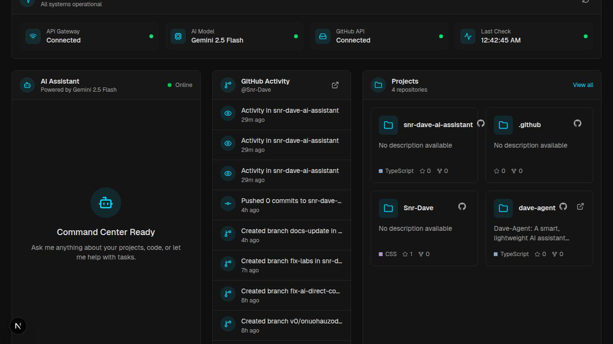

<div align="center">

# ⚡ Snr-Dave AI Assistant

### Personal Command Center — AI Chat · GitHub Intelligence · System Monitoring

[](https://nextjs.org)
[](https://typescriptlang.org)
[](https://tailwindcss.com)
[](https://ai.google.dev)
[](https://replit.com)

---

</div>

## 🖥️ Dashboard Preview



> **Deep Charcoal** background · **Electric Cyan** accents · Live data across every panel

---

## ✨ Features

### 🤖 AI Chat Assistant
- Streaming conversations powered by **Google Gemini 2.5 Flash**
- Real-time typing indicator and send-button spinner during generation
- Full message history with auto-scroll
- Model status badge shown in the chat header
- **GitHub Agent Tools** — the AI can read files, create branches, and commit code directly to your repos

### 🐙 GitHub Activity Feed
- Live feed of the latest events from `@Snr-Dave` via a server-side proxy
- Push events, PR merges, branch creation, issues, stars, and more
- Event-specific icons and relative timestamps
- Auto-refreshes every **60 seconds** via SWR

### 📁 Projects Grid
- Pulls repositories live from the GitHub API (server-side with auth)
- Shows language badge, star count, and fork count per repo
- Filters out forks — only original work shown
- External link to each repository

### 📡 System Status Bar
- Health checks for **API Gateway**, **AI Model**, and **GitHub API**
- Displays last-check timestamp
- Auto-checks every 60 seconds, manual refresh button available
- All-green · partial-warning · offline states with distinct colour coding

---

## 🛠️ Tech Stack

| Layer | Technology |
|-------|-----------|
| **Framework** | Next.js 16.2.4 — App Router + Turbopack |
| **Language** | TypeScript 5.x |
| **AI Runtime** | Vercel AI SDK v6 (`ai@6`) + `@ai-sdk/google` |
| **AI Model** | Google Gemini 2.5 Flash |
| **GitHub Client** | Octokit REST (`@octokit/rest`) |
| **Styling** | Tailwind CSS v4 — utility-first |
| **Data Fetching** | SWR — stale-while-revalidate |
| **Icons** | Lucide React |
| **Fonts** | Geist Sans · Geist Mono |
| **Platform** | Replit (dev & prod) |

---

## 🤖 GitHub Agent Tools

The AI assistant has direct access to your GitHub repositories via three built-in tools. These run **server-side** using `GITHUB_TOKEN` — the model decides when to call them based on your messages.

| Tool | What it does |
|------|-------------|
| `readFile` | Read any file from any `Snr-Dave` repo at any ref |
| `createBranch` | Create a new branch from a specified base |
| `commitFile` | Create or update a file and commit it to a branch |

> Built with **Vercel AI SDK v6** `tool()` + `jsonSchema<T>()` — up to 10 chained tool steps per conversation turn.

---

## 📂 Project Structure

```
snr-dave-ai-assistant/
├── app/
│   ├── api/
│   │   ├── chat/
│   │   │   └── route.ts          # AI chat — Gemini 2.5 Flash + GitHub tools
│   │   └── github/
│   │       ├── events/
│   │       │   └── route.ts      # Server-side GitHub events proxy
│   │       └── repos/
│   │           └── route.ts      # Server-side GitHub repos proxy
│   ├── globals.css               # Tailwind config & design tokens
│   ├── layout.tsx                # Root layout with Geist fonts
│   └── page.tsx                  # Main dashboard page
├── components/
│   ├── chat-window.tsx           # Streaming AI chat interface
│   ├── dashboard-header.tsx      # Top navigation bar
│   ├── github-feed.tsx           # Live GitHub activity feed
│   ├── projects-grid.tsx         # Repository cards grid
│   └── system-status.tsx         # Health monitoring bar
├── lib/
│   └── projects.ts               # Project type definitions
├── attached_assets/
│   └── screenshots/
│       └── dashboard-preview.jpg # Dashboard preview image
├── next.config.ts                # allowedDevOrigins for Replit HMR
└── replit.md                     # Replit environment reference
```

---

## 🔐 Environment Variables

Configure these as **Replit Secrets** (or `.env.local` for local dev):

| Secret | Required | Purpose |
|--------|----------|---------|
| `GOOGLE_API_KEY` | ✅ Yes | Google AI Studio key — powers Gemini 2.5 Flash |
| `GITHUB_TOKEN` | ✅ Yes | GitHub PAT — authenticated API calls + AI agent tools |

> Both secrets are used **server-side only** — never exposed to the browser.

---

## 🚀 Getting Started

### Prerequisites
- Node.js 18.x or later
- A [Google AI Studio](https://aistudio.google.com) API key
- A GitHub Personal Access Token with `repo` scope

### Run locally

```bash
# 1. Clone
git clone https://github.com/Snr-Dave/snr-dave-ai-assistant.git
cd snr-dave-ai-assistant

# 2. Install
npm install

# 3. Set secrets
cp .env.example .env.local
# → add GOOGLE_API_KEY and GITHUB_TOKEN

# 4. Start
npm run dev
# → http://localhost:5000
```

---

## 🌐 API Reference

### `POST /api/chat`
Stream a conversation with the AI assistant.

```json
// Request body
{
  "messages": [
    { "role": "user", "content": "What files are in my main repo?" }
  ]
}
```
**Response:** Server-Sent Events stream (AI SDK data stream protocol).

---

### `GET /api/chat`
Health check — confirms the model is reachable.

```json
{ "status": "ok", "model": "gemini-2.5-flash" }
```

---

### `GET /api/github/events`
Returns the latest 10 GitHub events for `@Snr-Dave`.
Authenticated server-side with `GITHUB_TOKEN` to avoid rate limits.

---

### `GET /api/github/repos`
Returns original (non-forked) repositories for `@Snr-Dave`.
Authenticated server-side with `GITHUB_TOKEN`.

---

## 🎨 Design System

### Colour Palette

| Token | Hex | Role |
|-------|-----|------|
| Background | `#0f0f0f` | Deep Charcoal — primary canvas |
| Card | `#171717` | Panel / card surfaces |
| Muted | `#262626` | Secondary backgrounds, dividers |
| Accent | `#00d9ff` | Electric Cyan — interactive & active states |
| Foreground | `#f5f5f5` | Primary text |
| Muted Text | `#a3a3a3` | Secondary / metadata text |

### Typography
- **Geist Sans** — UI text, headings, body
- **Geist Mono** — code snippets, timestamps, technical labels

---

## 🔄 Migration History

| Version | Change |
|---------|--------|
| v1.0 | Initial build — Vercel AI Gateway + static project list |
| v1.1 | Migrated from Vercel to **Replit** — port 5000, `allowedDevOrigins` |
| v1.2 | Switched AI backend to `@ai-sdk/google` with `GOOGLE_API_KEY` |
| v1.3 | Added server-side GitHub proxy routes with `GITHUB_TOKEN` via Octokit |
| v1.4 | Wired live GitHub data into feed, projects grid, and system status |
| v1.5 | Added **GitHub Agent Tools** (readFile, createBranch, commitFile) to chat |
| v1.6 | Fixed TypeScript: `parameters` → `inputSchema` (AI SDK v6 rename) |
| v1.6 | Fixed ESLint: `react-hooks/set-state-in-effect` in system status |
| v1.6 | Upgraded model label to `gemini-2.5-flash` across all UI and API |

---

## 📄 License

MIT — use freely as a starting point for your own AI command center.

---

<div align="center">

Built by **[Snr-Dave](https://github.com/Snr-Dave)** · Powered by Gemini · Hosted on Replit

</div>
